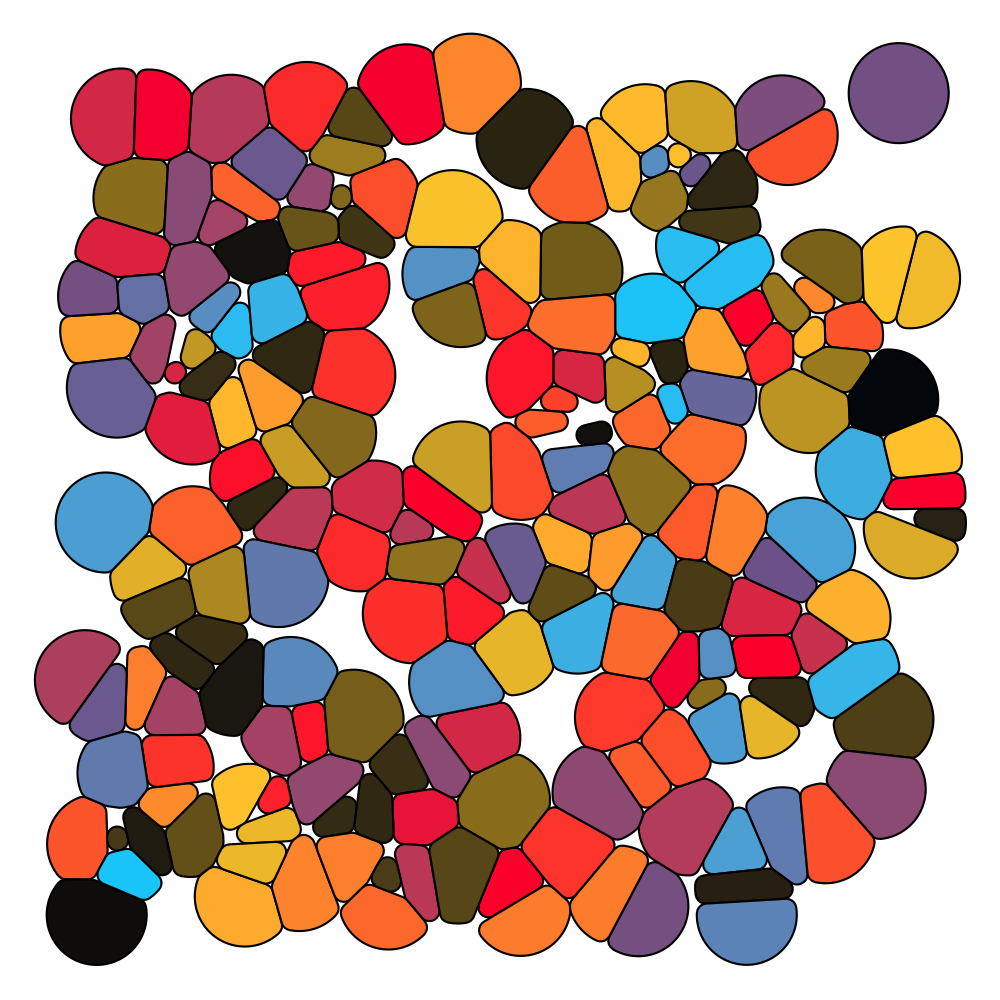

# Art with R

Playing around with R code to create art. All based on **Danielle Navarro's** tutorial: [https://art-from-code.netlify.app/](https://art-from-code.netlify.app/).

All required packages are available from CRAN, except `voronoise`. To install:

```R
remotes::install_github("djnavarro/voronoise")
```

## Some examples




